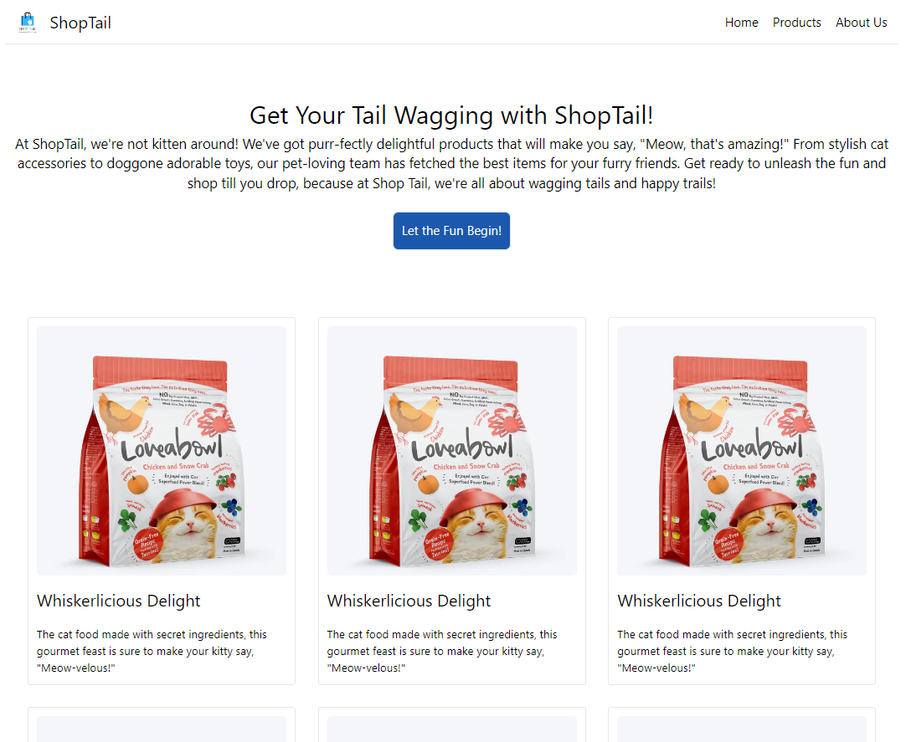

# ShopTail - Tailwind CSS Demo Website

Welcome to the ShopTail repository! This project is a static full mock-up of a shopping website created using the Tailwind CSS framework. ShopTail provides a playful and stylish online shopping experience for pet lovers, showcasing the capabilities of Tailwind CSS for creating visually appealing user interfaces.

## Technologies Used
- HTML5
- CSS3
- Tailwind CSS

## Preview
You can see a live preview of the ShopTail website [here](https://shakeebparwez.github.io/shoptail-tailwind).

## Customization
Feel free to customize the website by modifying the HTML and CSS files. Tailwind CSS utility classes are used throughout the project, making it easy to tweak the styling and layout.

## Acknowledgements
- The creators of Tailwind CSS for providing a fantastic CSS framework.

Enjoy browsing the delightful products on ShopTail!
